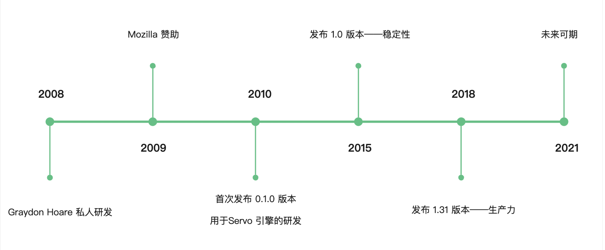
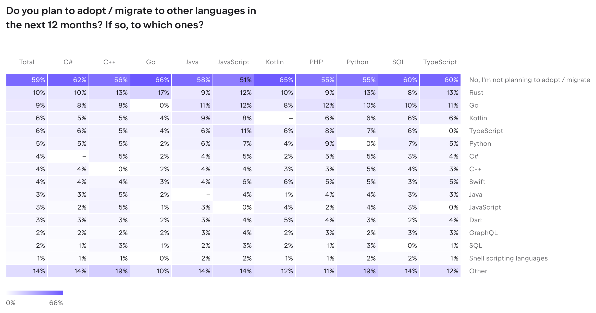

## Rust 发展史

Graydon 是 Mozilla 的一位职业编程语言工程师，给其他语言开发编译器和工具集，在 2008 年私人研发了 Rust 这门语言，正值当时 Mozilla 要开发 firefox 的 Servo 引擎，想在保证安全的同时有着高性能，于是就瞄准了 Rust，开始赞助。

其实 2010 年到 2015 年的早期的 Rust 是有 GC 的，不过还好 Rust 团队在 1.0 前夕做了一个英明的决定，把 GC 给干掉了，所以在 2015 年发布 1.0 版本的时候，确定了 Rust 的高性能+高安全性的特性。1.0 的发布，对 Rust 来说，意味着稳定性的保证。

Rust 的规划是以三年为一个节点的，在 2015 年到 2018 年的三年期间呢，Rust 主要解决的问题是“生产力”，在这段时间里 Rust 的工具链、文档、编译器都更加智能，对开发者更加友好了。

2018 年到 2021 年的三年，Rust 完善了异步的生态，也就是从这时候开始，Rust 开始适用于写业务了，毕竟用同步写业务会遇到 C10k 问题。

2021 年到 2024 年，Rust 的规划是“扩展授权”，为啥叫“扩展授权（empowerment）”呢，因为 Rust 的目标是“empower everyone to build reliable（可靠的） and efficient（高效的） software”。Rust 官方团队关注到了大家一直吐槽的“Rust 难学”的问题，在完善了 Rust 的基础特性之后，开始着重关注在易用性和项目落地上。

[#数据来源](https://www.jetbrains.com/lp/devecosystem-2023/languages/#adopt_by_primary)

于此同时，我们也在经历着开源项目的爆炸性增长，可以说“一切能用 Rust 重写的项目都将或者正在用 Rust 重写”。

一门语言的未来，光受开发者喜爱是不够的，关键还在于企业是否接受。

世界上知名的很多公司都早早就瞄准了 Rust 语言，比如 Meta 从 2016 年开始就已经开始推动公司内 Rust 的应用、微软用 Rust 解决内存安全问题、Google 在 Chrome 和 Android 中使用 Rust、字节跳动和华为内部大量使用 Rust、Github 用 Rust 重写代码搜索引擎、蚂蚁金服用 Rust 重写时序数据库等等，同时也涌现出众多使用 Rust 的中小企业，在此不一一列举。

## Rust 特点与优势